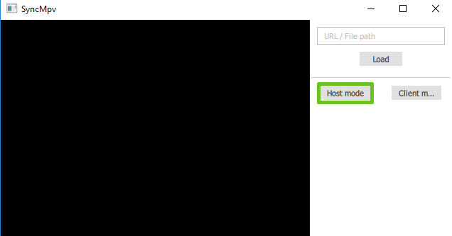
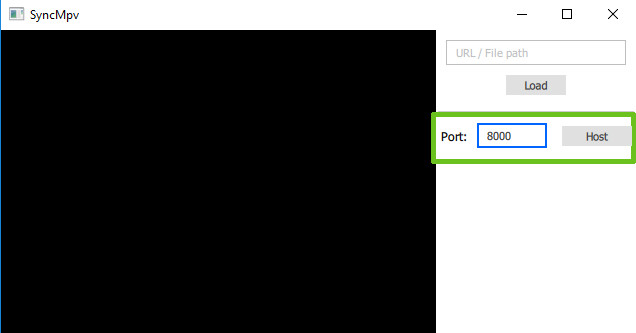
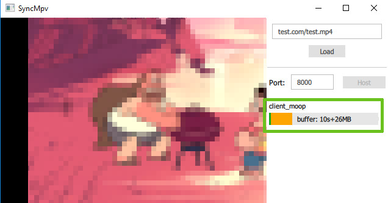

# SyncMPV

SyncMPV is based on the mpv media player and synchronizes the status of several players across computers in a host-client way. People can now comfortably get together in Skype and watch films together without being spoiled by the reaction of their friends. One must either provide a valid stream URL or a local media file. The host will not stream any content over the web at all. For Youtube/Google videos, please download the yt-dl tool into the folder of the executable.

## Host

1. Activate Host mode.

2. Set the port on which the clients can connect to the host application. Make sure that the port can be reached from the outside. You must open the ports in your router settings and allow network connections if prompted by your firewall.

3. Clients should now be able to connect to you. The Sidebar contains information about the buffer status (yellow) of your clients. Playing pauses whenever you or one of the clients run out of buffer. The green bar indicates their play progress. It should be the same as yours if syncing works correctly.

## Client

1. Activate Client mode

2. Insert the host's IP (IPv4 or IPv6) and port. Click on connect.

3. The console provides information if connection could be established and some helpful error messages if not.